# Boorusphere  

Simple, content-focused booru viewer for Android

<a href="https://github.com/nullxception/boorusphere/releases">
    
</a>
<a href="https://apt.izzysoft.de/fdroid/index/apk/io.chaldeaprjkt.boorusphere">
    
</a>

# Preview

<details open>
    <summary>Feature and Content</summary>
        <p align="center">
         
         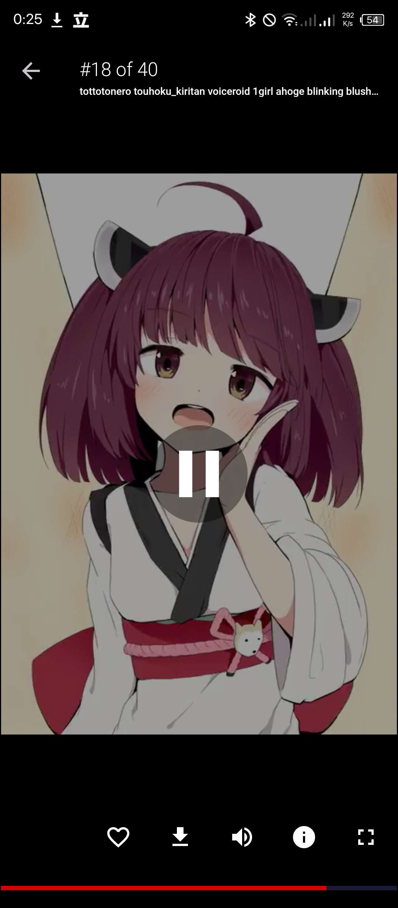
         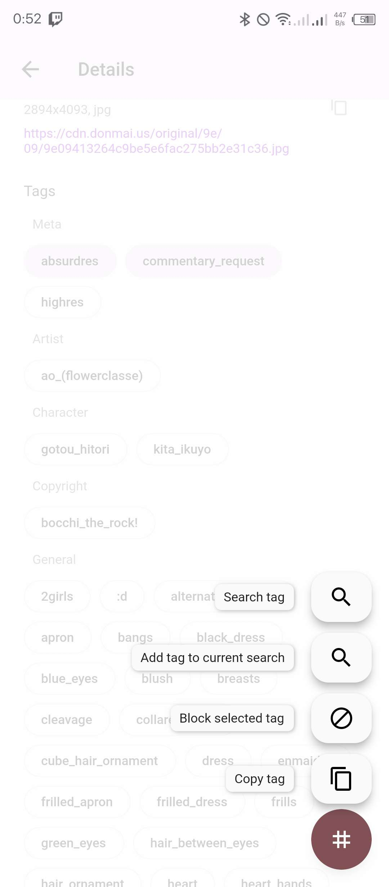
         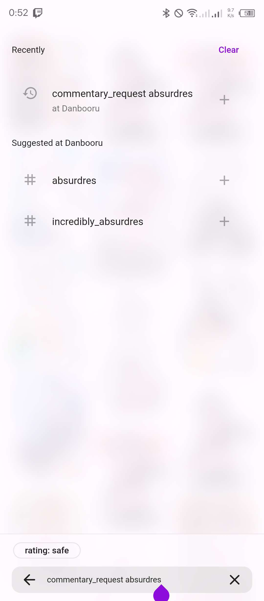
     </p>
</details>

<details>
    <summary>Light Theme</summary>
        <p align="center">
         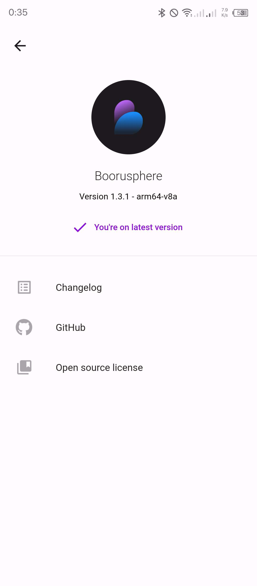
         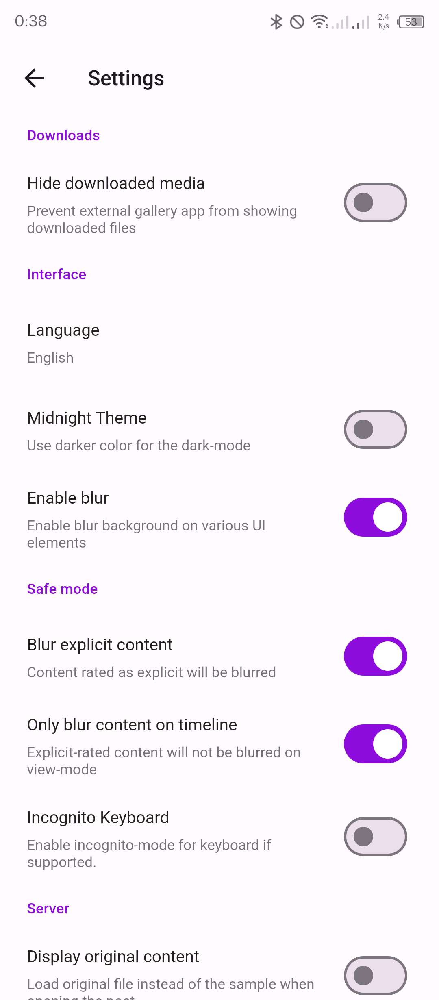
         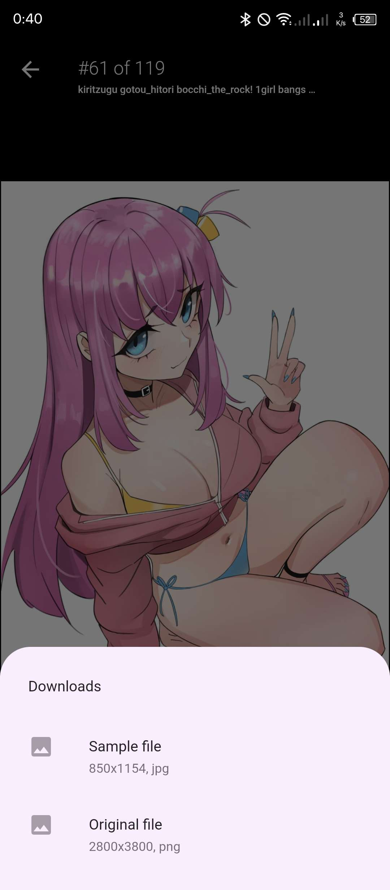
         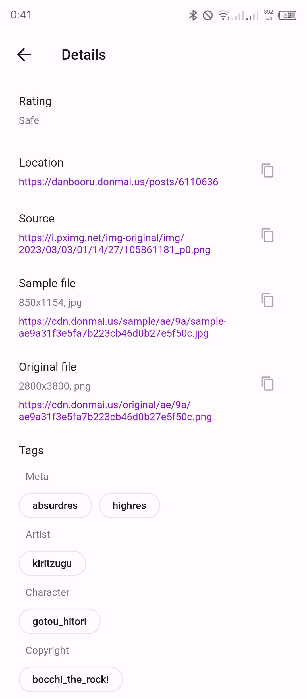
     </p>
</details>

<details>
    <summary>Dark Theme</summary>
        <p align="center">
         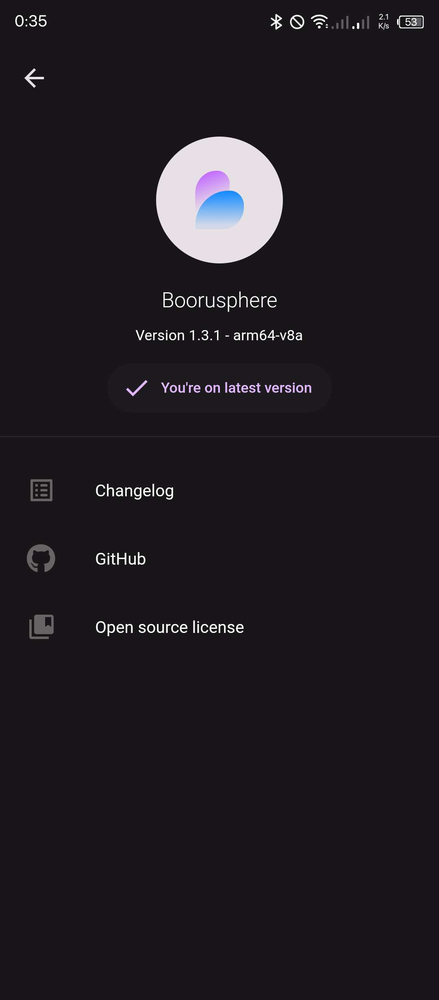
         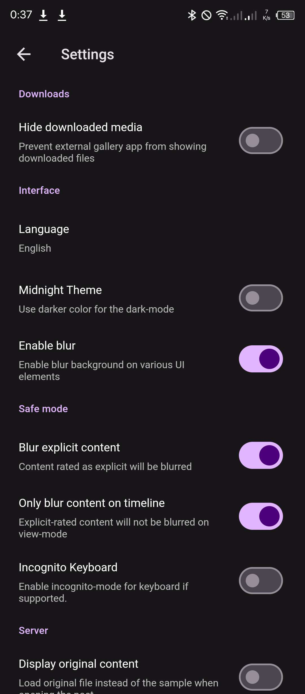
         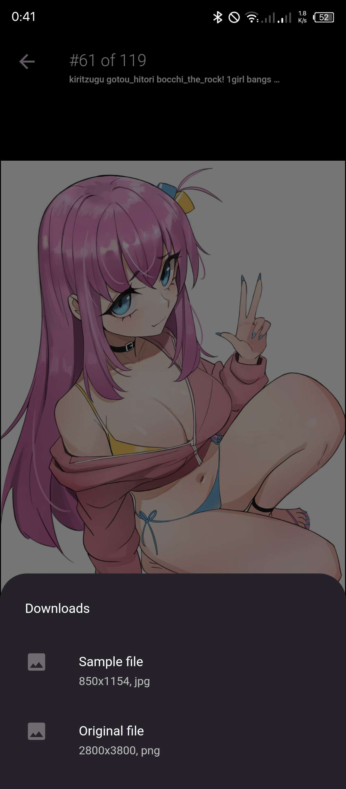
         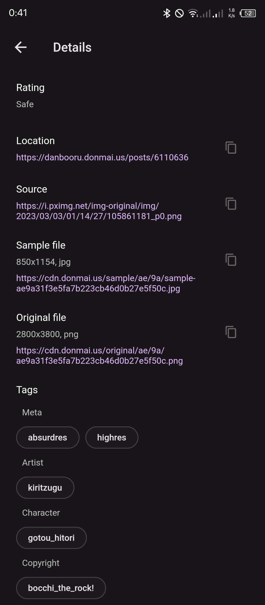
     </p>
</details><br/>

# Building

This projects uses several code generators such as [freezed](https://github.com/rrousselGit/freezed), [json_serializable](https://github.com/google/json_serializable.dart), [hive_generator](https://github.com/hivedb/hive), and [auto_route_generator](https://github.com/Milad-Akarie/auto_route_library).

So if you're editing some areas that needs a code generator such as entities, routing, i18n, or add/removing packages, make sure to run the code generator before building.

```bash
# Sync dependencies
$ flutter pub get

# Generate everything that needed
$ derry gen all
# ..or just regenerate i18n
$ derry gen lang
```

Run `derry ls` for complete list of script available.

After that, you can use regular `flutter` commands to deploy app to your device, for example:

```bash
# run app in debug mode
$ flutter run
```

For more details, see [Flutter's build modes](https://docs.flutter.dev/testing/build-modes).

# License

This work is licensed under [BSD 3-Clause License](LICENSE.md).
