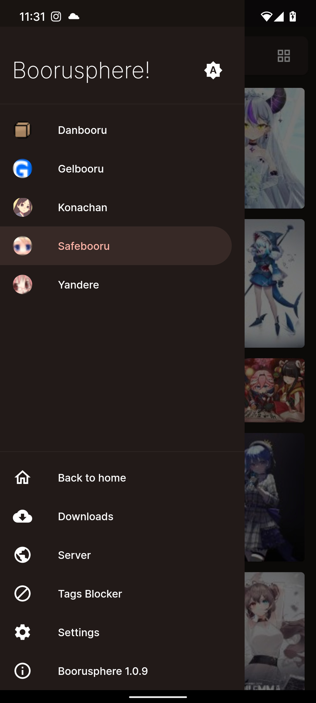
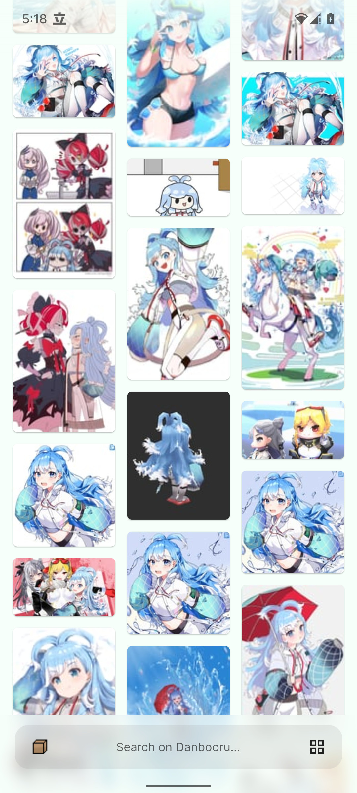
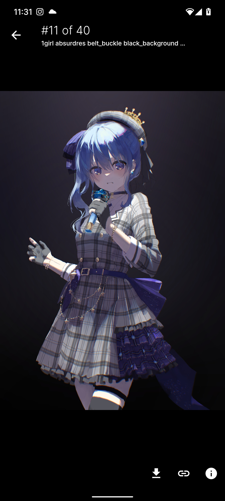
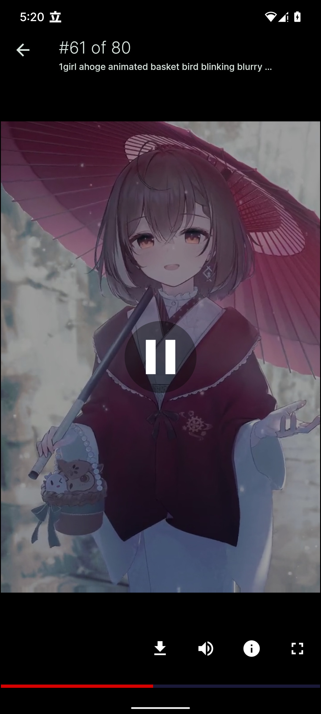

<p align="center">
    
    <br/>
    <i>Yet another booru imageboards viewer for Android</i>
</p>

## Download
<a href="https://apt.izzysoft.de/fdroid/index/apk/io.chaldeaprjkt.boorusphere">
    
</a>
<a href="https://github.com/nullxception/boorusphere/releases">
    
</a>

## Preview

<p align="center">
    
    
    
    
</p>

## Building

You can build this app just like any other flutter app, for example:

```bash
$ flutter build apk --target-platform=android-arm64
```

This projects uses several code generator such as [`freezed`](https://github.com/rrousselGit/freezed), [`json_serializable`](https://github.com/google/json_serializable.dart), and [`license_generator`](https://github.com/icapps/flutter-icapps-license), so if you're editing some areas that needs a code generator (such as models) or add/removing packages, make sure run the build_runner before debugging:

```bash
$ flutter pub run build_runner build --delete-conflicting-outputs
$ flutter pub run license_generator generate
```

## License

This work is licensed under [BSD 3-Clause License](LICENSE.md).
