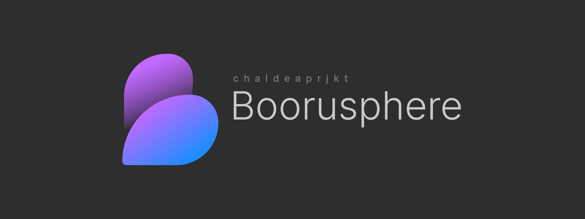
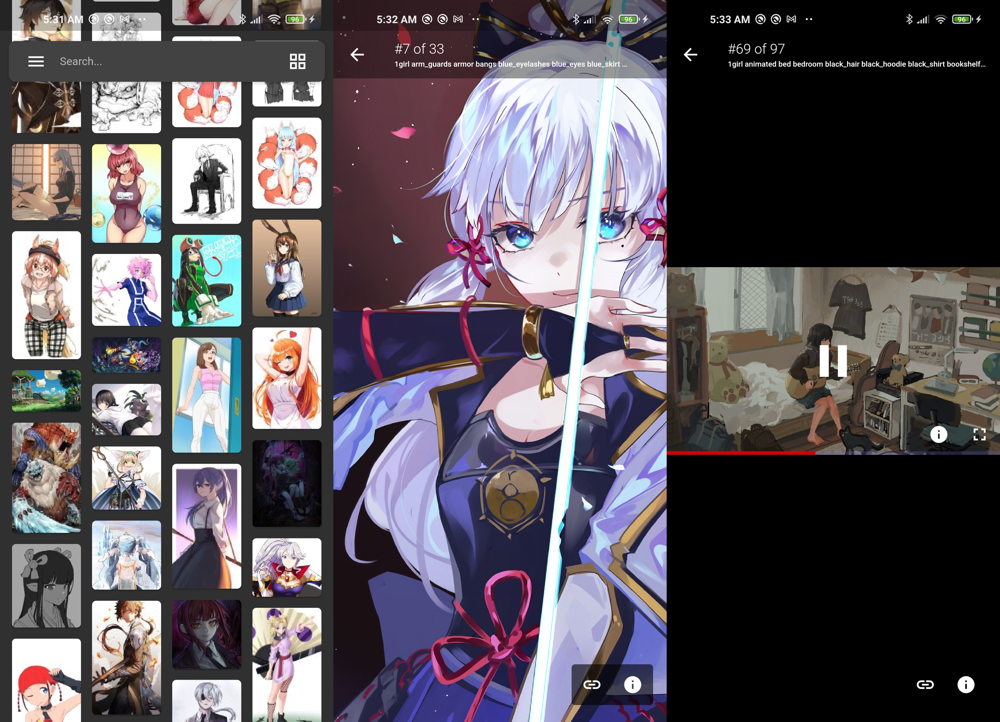

<p align="center"></p>
<h3 align="center">Yet another booru imageboards viewer for Android</h3>
<p align="center"></p>

## Download

You can directly go to the [Releases Page](https://github.com/nullxception/boorusphere/releases) and download the appropriate version for your device.

## Development notes

Since some of the dependencies are not ready for dart's sound null-safety, you have to pass `--no-sound-null-safety` args when building this app, for example :

```bash
$ flutter build apk --target-platform=android-arm64 --no-sound-null-safety
```

This projects uses several code generator such as [`freezed`](https://github.com/rrousselGit/freezed) and [`json_serializable`](https://github.com/google/json_serializable.dart), so if you're editing some areas that needs a code generator (such as models), make sure run the build_runner before debugging:

```bash
$ flutter pub run build_runner build --delete-conflicting-outputs
```

## License

This work is licensed under [BSD 3-Clause License](LICENSE).
